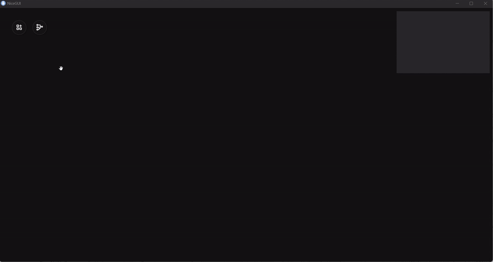

# Node graph editor using vue/node and nicegui/python

This component based on [flow](https://github.com/sunag/flow)



## Using vue/nodejs

### Project Setup

```sh
npm install
```

### Compile and Hot-Reload for Development

```sh
npm run dev
```

### Compile and Minify for Production

```sh
npm run build
```

### Lint with [ESLint](https://eslint.org/)

```sh
npm run lint
```

## Using nicegui/python

### Project Setup

```sh
python -m pip install nicegui
```

### Compile and Hot-reload for development
```sh
cd src
python ./try-1.py
```
